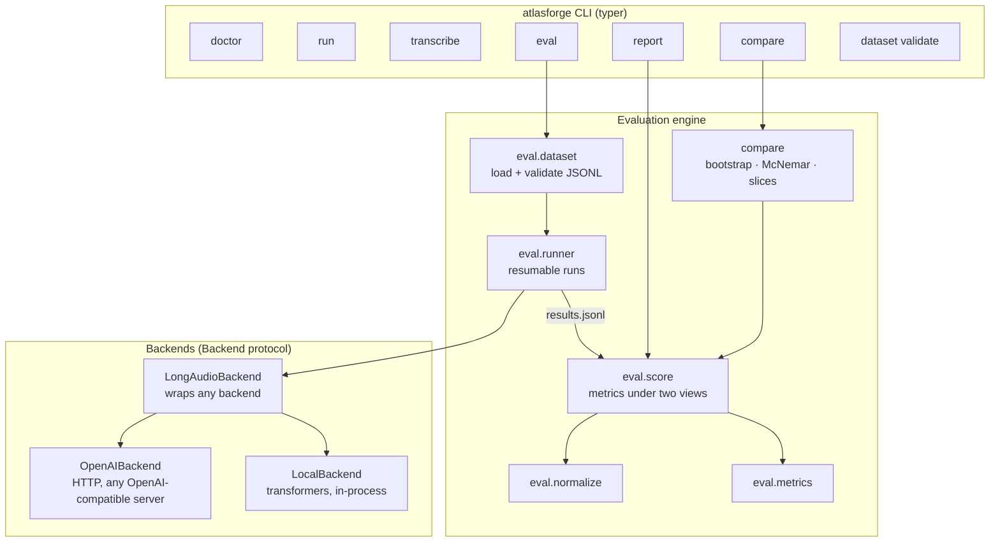
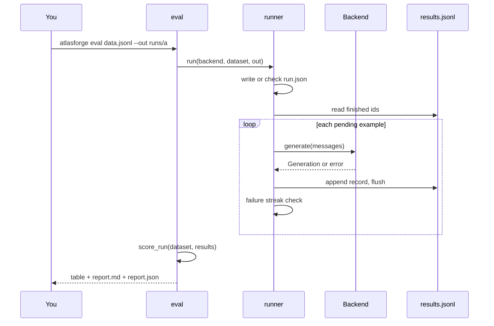

# How AtlasForge works

AtlasForge is a thin command line over a small Python library. This page explains the moving parts, so you can predict what a command will do and extend it.

## The big picture



Three ideas hold the design together.

### 1. A backend is anything with four methods

Every model, wherever it runs, is reached through the `Backend` protocol:

```python
class Backend(Protocol):
    def generate(self, messages, params=None) -> Generation: ...
    def transcribe(self, audio, lang) -> Transcript: ...
    def info(self) -> BackendInfo: ...
    def close(self) -> None: ...
```

The evaluation engine only ever sees this protocol. That is why the same `eval` command works against a vLLM server, a quantised Ollama model or in-process `transformers` weights. A backend that lacks a capability raises `UnsupportedFeatureError` and does not advertise it in `info().capabilities`.

| Backend | Use it for | Where it runs |
|---|---|---|
| `openai` | any OpenAI-compatible HTTP server | wherever the server is |
| `local` | `transformers` weights, LLM and ASR | in your Python process |

### 2. Running and scoring are separate steps

`eval` first collects the model's answers into `results.jsonl`, then scores them. Because scoring is a pure function of those saved answers, you can re-score a finished run with different metrics or settings without touching the model, using `atlasforge report`. Likewise `compare` re-scores both runs itself rather than trusting stored numbers.

### 3. Everything is paired and fingerprinted

A dataset's SHA-256 hash is recorded in every run. `compare` refuses to pair two runs unless they came from exactly the same dataset file and task, because a comparison between different examples is meaningless. Per-example scores are kept so statistics can be **paired**: each example is compared with itself under both models.

## Lifecycle of `atlasforge eval`

1. **Load and validate the dataset** (`load_dataset`). Stops at the first malformed line with its line number.
2. **Build the backend** from `--backend`, `--base-url`, `--model` and friends. For ASR datasets the backend is wrapped in `LongAudioBackend` so clips over 30 seconds are chunked.
3. **Check or write the manifest** `run.json`. If the directory already holds a run, its identity (task, dataset hash, model, revision, generation parameters, language) must match, otherwise AtlasForge refuses rather than silently mixing results.
4. **Skip finished examples.** Examples already answered successfully are not re-run. Failed ones are retried unless you pass `--no-retry-errors`.
5. **Run the rest**, one at a time or with bounded concurrency, appending each record to `results.jsonl` the moment it finishes.
6. **Watch for a dead server.** After `--max-consecutive-failures` failures in a row (default 20) the run stops with everything finished so far kept. Fix the cause and re-run the same command to resume.
7. **Score** the results under both tone views and write `report.md` and `report.json`.



### Crash safety

Each record is flushed as it is written. If the process dies mid-write, the truncated last line is detected and dropped on the next run, and that one example simply runs again. A corrupt line anywhere **else** raises an error instead of being skipped, because silently ignoring it would hide data loss.

### Bounded concurrency

With `--concurrency N`, at most `2 × N` examples are in flight at once. Queueing every example up front would fire every request at a dead server and hold one pending task per example in memory. Results are written from a single thread, so the file is never interleaved.

!!! tip "Use concurrency only for HTTP backends"
    Concurrency suits servers that batch requests (vLLM, hosted gateways). Keep it at `1` for the `local` backend, where one set of weights serves one request at a time.

## Failure handling, in one place

| Situation | What AtlasForge does |
|---|---|
| A request fails (timeout, HTTP error, connection) | records `error` for that example, keeps going |
| Many requests fail in a row | stops after the threshold, keeps progress, tells you how to resume |
| A failed example when scoring | scored as an **empty answer**: wrong for accuracy, all-words-deleted for WER, zero for chrF |
| A missing example when scoring | same as a failure, and counted separately as `missing` |
| An unexpected exception inside a call | recorded as `UnexpectedError: <type>` only, so prompt text can never leak through an exception message |
| Exit code | `1` only if **every** example failed; otherwise `0` with a warning on stderr |

## Where the code lives

| Package | Responsibility |
|---|---|
| `atlasforge.cli` | the command line, thin over the library |
| `atlasforge.types` | shared data types: `Message`, `GenParams`, `Generation`, `Transcript`, `BackendInfo` |
| `atlasforge.backends` | the `Backend` protocol, `OpenAIBackend`, `LocalBackend`, a factory |
| `atlasforge.eval` | dataset loading, normalisation, metrics, runner, scoring, reports, validation |
| `atlasforge.compare` | paired bootstrap, McNemar, slice analysis, comparison reports |
| `atlasforge.asr` | audio decoding via ffmpeg, windowing, merging, long-audio wrapper |
| `atlasforge.doctor` | the environment checks behind `doctor` |
| `atlasforge.errors` | the error hierarchy, each with an actionable hint |
| `atlasforge.security` | secret masking |

Importing `atlasforge` is deliberately cheap: it loads no ML framework. `torch` and `transformers` are imported lazily, only inside the `local` backend. A CI job installs the core package alone and fails if either appears.
