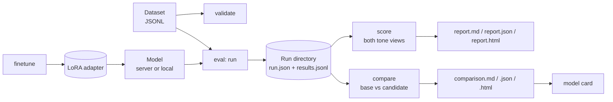

# How it works

AtlasForge turns *a dataset and a model* into *evidence about whether a change helped*. It does this in separate, inspectable steps.

## The steps

| Step | Command | What it does | Needs a model? |
|---|---|---|---|
| **Validate** | `dataset validate` | Finds problems in the data before they spoil a result | No |
| **Run** | `eval` | Sends each example to the model and records the raw answer | **Yes** |
| **Score** | `eval` (automatic), `report` | Turns raw answers into metrics, as JSON, Markdown and a self-contained HTML page | No |
| **Compare** | `compare` | Pairs two runs example by example and tests the difference | No |
| **Fine-tune** | `finetune` | Trains a LoRA adapter | Yes (GPU) |
| **Card** | `card` | Writes a model card from the results | No |

The important design choice is that **running a model and scoring it are separate**. A run records raw answers once. You can re-score it later with different metrics, or compare it to another run, without calling the model again.

## Backends

A *backend* is anything that can answer prompts and transcribe audio. Every command works with every backend.

| Backend | Use it for |
|---|---|
| `openai` | Any OpenAI-compatible server: vLLM, llama.cpp, Ollama, a Hugging Face Endpoint, or a community gateway. The default. |
| `local` | Loading the models in-process with Transformers. Heavy dependencies, imported only when used. |

Speaking the OpenAI protocol is just a transport choice. The model behind the server must be an official `NCAIR1` model; the run records which model it was. [How AtlasForge integrates N-ATLAS](n-atlas-integration.md) lists the five official repositories and how each is loaded.

## Design rules

These rules explain choices you will see throughout the tool.

**Honest by default.** Failed calls count as wrong. Small slices are not judged. Both tone views are always shown. Sample runs are labelled synthetic.

**Nothing is hidden.** Every report states the dataset fingerprint, the model, the revision, and the settings used. Nothing is normalised without saying so.

**Private by default.** Error messages never contain prompt text or server response bodies, because servers sometimes echo prompts. Tokens are shown masked. There is no telemetry.

**Safe to interrupt.** Runs write results as they go. A crash, a Ctrl-C or a dead server loses nothing already finished.

**Light to install.** The base install pulls in no machine-learning framework. Heavy libraries are optional extras, imported lazily.

**Only official models.** The core never routes requests to another company's model, and there is no model-as-judge.
