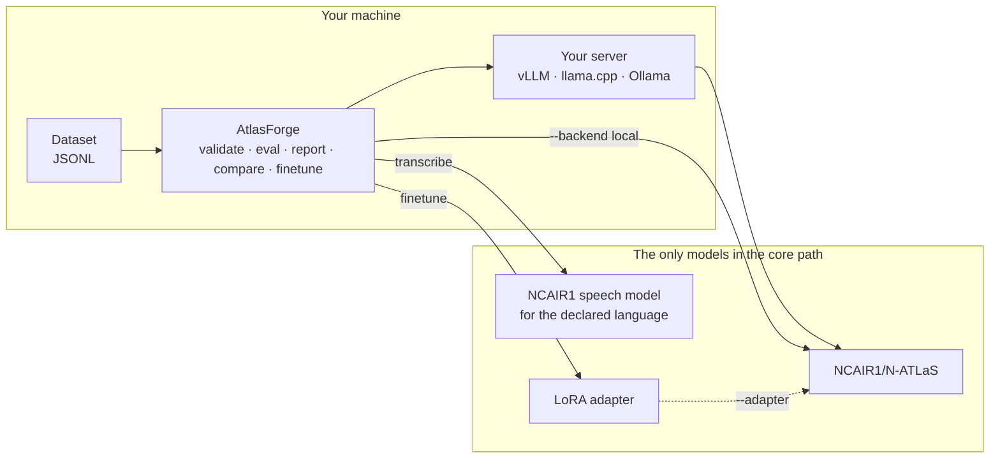

# How AtlasForge integrates N-ATLAS

N-ATLaS is published as **gated open weights on Hugging Face**, not as a hosted API. There is no
endpoint to call. So "integrating" N-ATLaS means three concrete things: knowing which repositories
are the official ones, loading or serving them correctly, and never quietly using anything else.

## The five official repositories

Everything AtlasForge runs comes from these. They live in one place in the code
(`atlasforge.asr.models.ASR_MODELS` and `atlasforge.backends.factory.DEFAULT_MODEL`), and a test
fails if any other identifier appears anywhere in the project.

| Role | Repository | Language |
|---|---|---|
| LLM | [`NCAIR1/N-ATLaS`](https://huggingface.co/NCAIR1/N-ATLaS) | Hausa, Yoruba, Igbo, Nigerian English |
| Speech | [`NCAIR1/Hausa-ASR`](https://huggingface.co/NCAIR1/Hausa-ASR) | `ha` |
| Speech | [`NCAIR1/Yoruba-ASR`](https://huggingface.co/NCAIR1/Yoruba-ASR) | `yo` |
| Speech | [`NCAIR1/Igbo-ASR`](https://huggingface.co/NCAIR1/Igbo-ASR) | `ig` |
| Speech | [`NCAIR1/NigerianAccentedEnglish`](https://huggingface.co/NCAIR1/NigerianAccentedEnglish) | `en` |

All five are gated. You accept the Awarri licence on each model page yourself, while logged in;
[Access and licences](../get-started/access-and-licences.md) has the links, and
`atlasforge doctor` tells you which ones you have not accepted yet. **AtlasForge never downloads,
mirrors or redistributes the weights.**

## Where the models sit

There is no other model in that picture, and no model-as-judge: nothing scores AtlasForge's output
with a second model. Metrics are arithmetic over the answers N-ATLaS gave.

## Loading

Which model a command uses is decided in this order — flag, then environment, then
`atlasforge.toml`, then the built-in default ([configuration](../reference/configuration.md)). The
default is `NCAIR1/N-ATLaS`. The resolved name, and the revision it resolved to, are written into
the run manifest, so a report always says which weights produced it.

| Backend | How the model is loaded |
|---|---|
| `openai` (default) | Nothing is loaded here. You serve N-ATLaS yourself and point `--base-url` at it. See [Serve N-ATLaS](../guides/serve-n-atlas.md). |
| `local` | Transformers loads the weights in-process: `--quantize none\|4bit\|8bit`, `--device auto\|cpu\|cuda\|mps`. Needs the `local` extra. |

A LoRA adapter is loaded with `--adapter`, and it is part of the model's identity rather than a
separate setting: a run records `NCAIR1/N-ATLaS+your-adapter`, so an adapter run and a base run can
never be mistaken for one another in a comparison.

## Routing speech

The four speech models are monolingual, so there is nothing to route: the declared `lang` selects the
checkpoint, by lookup. A speech dataset carries `lang` per example, and the right model is chosen for
each one.

**AtlasForge does no language detection.** The declared language is trusted. That is deliberate — a
detector would be another model in the core path, and it would be one more thing to be wrong quietly.
The cost is real and worth stating: a wrong `--lang` produces confidently wrong text rather than an
error.

## What the repositories actually say

Facts about the models are only worth anything if you know how they were found out. Each row below
is **verified**: read from the repository's own files, or observed in a run on 30 September to
2 October 2026 on an Apple M1 with 16 GB. Everything else about the models is in the model cards,
and is not repeated here as fact. The full log, with the evidence for each row, is in
`planning/21_NATLAS_DISCOVERY.md`.

!!! warning "Where the model card and the files disagree"
    1. **Context length.** The card says 8,092. The repository's `config.json` says
       `max_position_embeddings = 131072`. Which one the model behaves well at was not tested;
       treat 131072 as a ceiling, not a recommendation.
    2. **Generation defaults.** The card recommends `temperature=0.1`, `repetition_penalty=1.12` and
       `max_new_tokens=1000`. The repository's `generation_config.json` ships `temperature=0.6` and
       no repetition penalty. AtlasForge sends the card's values explicitly on every request, so a
       server's own defaults never change an evaluation.

| Fact | Value | How it was verified |
|---|---|---|
| LLM architecture | `LlamaForCausalLM`, hidden size 4096, 32 layers, vocabulary 128,256 | `config.json` |
| LLM weights | four safetensors shards, 16.08 GB in bfloat16 | the repository's file listing |
| Chat template | present: the Llama-3.1-Instruct format, with a default "Cutting Knowledge Date: December 2023 / Today Date: 26 Jul 2024" system block | `tokenizer_config.json` |
| Fits a 16 GB machine at fp16? | **No**: 16.08 GB of weights against 17.18 GB of total memory | arithmetic; a live load was deliberately not attempted, because it risks freezing the machine |
| Runs as int4 on that machine | **Yes**, 6.6 GB through Ollama | a real run ([Serve N-ATLaS](../guides/serve-n-atlas.md#option-3-ollama-simplest-on-a-laptop)) |
| Speech architecture | `WhisperForConditionalGeneration` for all four models | each `config.json` |
| Speech input | 16 kHz, 30-second windows, 80 mel bins | each `preprocessor_config.json` |
| Speech timestamps | `transformers` can return them: coarse segments with `return_timestamps=True`, per-word with `"word"` | a run on `Hausa-ASR` (AtlasForge does not use them) |

The revisions these facts were read from: `N-ATLaS` `e294476`, `Hausa-ASR` `e635b9e`,
`Yoruba-ASR` `d1ae7b8`, `Igbo-ASR` `1807322`, `NigerianAccentedEnglish` `3c52c6e` (full hashes in
the planning log). Models can change after that date; pin a revision when you need to reproduce a
result.

Not yet verified: loading the LLM at fp16 or 4-bit through `transformers`, serving it with vLLM, and
any benchmark score. [Project status](../help/status.md) keeps that list.

## Where the boundary is

The `openai` backend speaks the OpenAI protocol, which means it can be pointed at any compatible
server. That is a transport decision, not a licence to use another model: the model behind the
server is yours to choose, and the project's claim is about what *AtlasForge* does — it names no
model other than the five above, loads none other, and installs none other. Everything in CI is
either a stand-in that answers from fixed rules or the synthetic demo data.

If you want to check the claim rather than take it: `grep -r "NCAIR1/" src/` should return the
registry and nothing unexpected, and `tests/unit/test_model_ids.py` is the machine check that every
identifier named anywhere in the project is one of the five.
