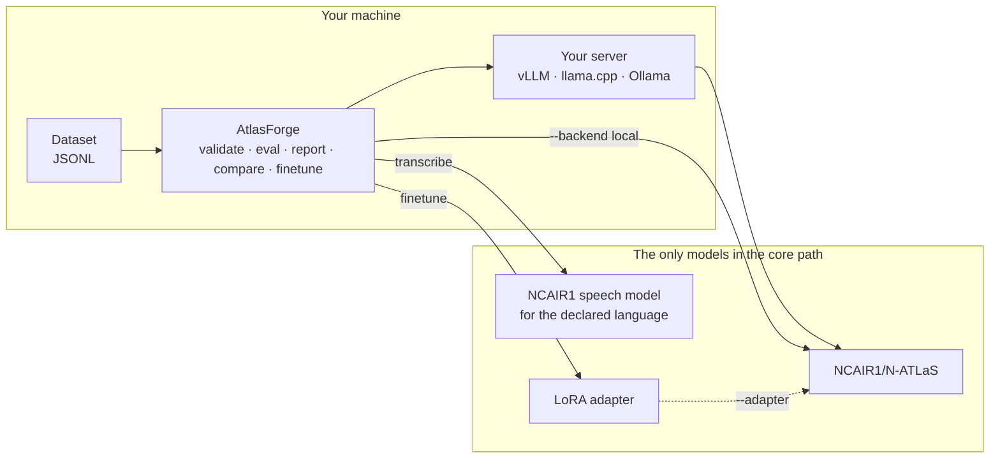

# How AtlasForge integrates N-ATLAS

N-ATLaS is published as **gated open weights on Hugging Face**, not as a hosted API. There is no
endpoint to call. So "integrating" N-ATLaS means three concrete things: knowing which repositories
are the official ones, loading or serving them correctly, and never quietly using anything else.

## The five official repositories

Everything AtlasForge runs comes from these. They live in one place in the code
(`atlasforge.asr.models.ASR_MODELS` and `atlasforge.backends.factory.DEFAULT_MODEL`), and a test
fails if any other identifier appears anywhere in the project.

| Role | Repository | Language |
|---|---|---|
| LLM | [`NCAIR1/N-ATLaS`](https://huggingface.co/NCAIR1/N-ATLaS) | Hausa, Yoruba, Igbo, Nigerian English |
| Speech | [`NCAIR1/Hausa-ASR`](https://huggingface.co/NCAIR1/Hausa-ASR) | `ha` |
| Speech | [`NCAIR1/Yoruba-ASR`](https://huggingface.co/NCAIR1/Yoruba-ASR) | `yo` |
| Speech | [`NCAIR1/Igbo-ASR`](https://huggingface.co/NCAIR1/Igbo-ASR) | `ig` |
| Speech | [`NCAIR1/NigerianAccentedEnglish`](https://huggingface.co/NCAIR1/NigerianAccentedEnglish) | `en` |

All five are gated. You accept the Awarri licence on each model page yourself, while logged in;
[Access and licences](../get-started/access-and-licences.md) has the links, and
`atlasforge doctor` tells you which ones you have not accepted yet. **AtlasForge never downloads,
mirrors or redistributes the weights.**

## Where the models sit

There is no other model in that picture, and no model-as-judge: nothing scores AtlasForge's output
with a second model. Metrics are arithmetic over the answers N-ATLaS gave.

## Loading

Which model a command uses is decided in this order — flag, then environment, then
`atlasforge.toml`, then the built-in default ([configuration](../reference/configuration.md)). The
default is `NCAIR1/N-ATLaS`. The resolved name, and the revision it resolved to, are written into
the run manifest, so a report always says which weights produced it.

| Backend | How the model is loaded |
|---|---|
| `openai` (default) | Nothing is loaded here. You serve N-ATLaS yourself and point `--base-url` at it. See [Serve N-ATLaS](../guides/serve-n-atlas.md). |
| `local` | Transformers loads the weights in-process: `--quantize none\|4bit\|8bit`, `--device auto\|cpu\|cuda\|mps`. Needs the `local` extra. |

A LoRA adapter is loaded with `--adapter`, and it is part of the model's identity rather than a
separate setting: a run records `NCAIR1/N-ATLaS+your-adapter`, so an adapter run and a base run can
never be mistaken for one another in a comparison.

## Routing speech

The four speech models are monolingual, so there is nothing to route: the declared `lang` selects the
checkpoint, by lookup. A speech dataset carries `lang` per example, and the right model is chosen for
each one.

**AtlasForge does no language detection.** The declared language is trusted. That is deliberate — a
detector would be another model in the core path, and it would be one more thing to be wrong quietly.
The cost is real and worth stating: a wrong `--lang` produces confidently wrong text rather than an
error.

## Where the boundary is

The `openai` backend speaks the OpenAI protocol, which means it can be pointed at any compatible
server. That is a transport decision, not a licence to use another model: the model behind the
server is yours to choose, and the project's claim is about what *AtlasForge* does — it names no
model other than the five above, loads none other, and installs none other. Everything in CI is
either a stand-in that answers from fixed rules or the synthetic demo data.

If you want to check the claim rather than take it: `grep -r "NCAIR1/" src/` should return the
registry and nothing unexpected, and `tests/unit/test_model_ids.py` is the machine check that every
identifier named anywhere in the project is one of the five.
