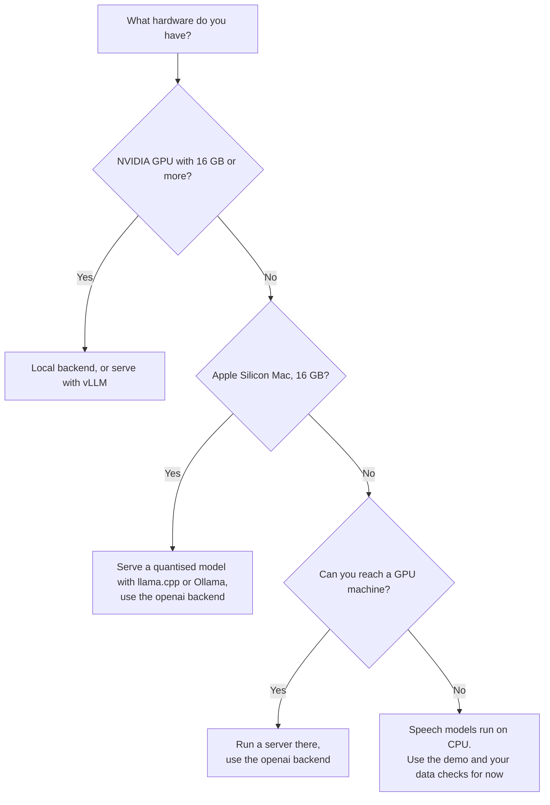

# Choose your setup

Because N-ATLaS has no public API, **you** decide where the model runs. AtlasForge talks to it in one of two ways:

- **`--backend openai`** (the default): any server that speaks the OpenAI-compatible protocol, such as vLLM, llama.cpp, Ollama or a Hugging Face Endpoint. The server can be on your machine or on another.
- **`--backend local`**: AtlasForge loads the model itself with Hugging Face Transformers.

## Which setup fits your hardware?

| Your hardware | LLM (8B) | Speech models | Fine-tuning |
|---|---|---|---|
| **NVIDIA GPU, 24 GB** | Local backend, or vLLM | Local | Yes (QLoRA) |
| **NVIDIA GPU, 8-16 GB** | 4-bit local (`--quantize 4bit`) | Local | Possibly, with small settings |
| **Apple Silicon, 16 GB** | Ollama or llama.cpp server (4-bit), `openai` backend. Ollama int4 verified; fp16 does not fit | Local (MPS or CPU), verified | No |
| **CPU only, 8 GB** | Not practical | Local, slowly (about 1 GB each) | No |
| **Remote GPU server** | `openai` backend | `openai` backend or local | On that server |
| **Nothing yet** | [Quickstart demo](quickstart.md) | | |

!!! warning "Only some of these have been run on real weights"
    The memory figures for NVIDIA GPUs are estimates, and the server-based paths for vLLM and llama.cpp are **untested**. What *has* been run, on a 16 GB Apple M1: all four speech models, and the LLM as an int4 import through Ollama. The [project status](../help/status.md) page lists exactly what is verified. Treat the rest of this table as a plan to confirm on your hardware, and share what you find.

## Apple Silicon notes

What was found running on a 16 GB M1:

- **The LLM at fp16 does not fit.** The weights alone are 16.08 GB, about 93% of the machine's memory, so do not try `--backend local` for the LLM there: it risks heavy swapping or freezing the machine. Serve a quantised copy instead ([Serve N-ATLaS](../guides/serve-n-atlas.md#option-3-ollama-simplest-on-a-laptop)). `--quantize 4bit` is not available on a Mac, because `bitsandbytes` needs an NVIDIA GPU.
- **Speech uses the Apple GPU.** `--device auto` picks CUDA if there is one, then Apple's MPS, then the CPU. Pass `--device cpu` to force the CPU.
- **`atlasforge doctor` says "no NVIDIA GPU detected".** That is expected: it only looks for NVIDIA GPUs, and the warning does not mean the Apple GPU is unusable.
- **A `scipy` wheel can fail to load on recent macOS.** The `asr` and `local` extras pin `scipy<1.15` on macOS for this reason; see [Troubleshooting](../help/troubleshooting.md#could-not-load-ncair1-importerror-on-macos).

## What to do next

- **Running a server?** [Serve N-ATLaS](../guides/serve-n-atlas.md)
- **Already have an endpoint?** [Evaluate a model](../guides/evaluate-a-model.md)
- **Speech only?** [Transcribe speech](../guides/transcribe-speech.md)
- **Want to fine-tune?** [Fine-tune with QLoRA](../guides/fine-tune-with-qlora.md)

## Why not a hosted playground?

A live "type a prompt" website would need a GPU running the model for every visitor. That costs money, needs access controls, and runs into the licence's 1,000-user cap. AtlasForge instead lets you **try it offline** with the [demo](quickstart.md) and **review results** from real runs. A live demo can be added if API access becomes available.
