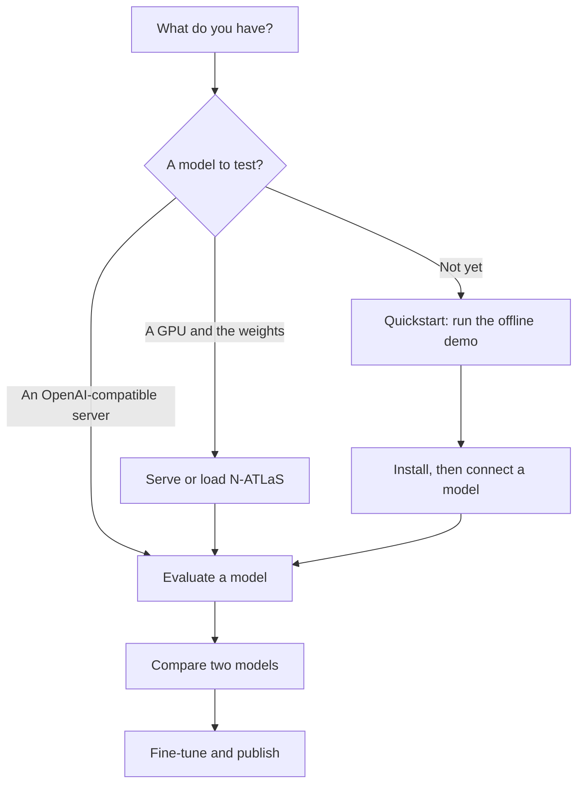

# Get started

Pick the path that matches what you have today.

| If you want to... | Go to |
|---|---|
| See what AtlasForge does, right now, with nothing to set up | [Quickstart](quickstart.md) |
| Install it, with or without the heavy extras | [Installation](installation.md) |
| Download N-ATLaS and understand the licence | [Access and licences](access-and-licences.md) |
| Decide how to run the models on your hardware | [Choose your setup](choose-your-setup.md) |

!!! tip "Never used it before?"
    Do the [Quickstart](quickstart.md) first. It takes about two minutes and every later page makes more sense afterwards.
