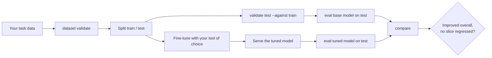

# Fine-tuning

!!! warning "Status: fine-tuning recipes are not written yet"
    AtlasForge v0.1 does **not** include fine-tuning code. The `finetune` extra installs the usual libraries (`peft`, `trl`, `datasets`), and recipes are planned, but nothing here is tested. This page explains what is planned and, more usefully, how to use AtlasForge **around** a fine-tune you do with other tools today.

## What AtlasForge gives you around a fine-tune

Fine-tuning is only worth doing if you can prove it helped. The loop is:



### 1. Check the data before training

```bash
atlasforge dataset validate train.jsonl --task generation
atlasforge dataset validate test.jsonl  --task generation --against train.jsonl
```

This catches duplicates, conflicting labels, stripped diacritics and, crucially, **train/test leakage**. A fine-tune evaluated on examples it saw in training measures memorisation, and every metric will look wonderful. `--against` makes that an error.

### 2. Measure the base model first

```bash
atlasforge eval test.jsonl --out runs/base --base-url http://127.0.0.1:8000/v1 --model NCAIR1/N-ATLaS
```

Do this **before** training so you have a baseline on exactly the same test file.

### 3. Fine-tune with your own tooling

Any approach works: LoRA/QLoRA with `peft` and `trl`, a full fine-tune, or something else. AtlasForge does not care how the model was produced, only that you can serve it.

### 4. Serve and evaluate the tuned model

Serve it behind an OpenAI-compatible endpoint (see [Serve the models](serve-models.md)), or load it with the `local` backend, then run the **same** test file:

```bash
atlasforge eval test.jsonl --out runs/tuned --base-url http://127.0.0.1:8001/v1 --model my-finetune
```

### 5. Compare

```bash
atlasforge compare test.jsonl --base runs/base --candidate runs/tuned --out cmp --slice domain
```

You are looking for two things: the overall verdict, and **any slice that regressed**. A fine-tune that improves your target domain while quietly getting worse at another language or text length is the failure this tool exists to catch. See [Compare two models](compare.md).

## Practical advice

- **Hold the test set out from the start.** Never tune on it, and never look at its errors and then add similar items to the training data.
- **Keep the same dataset file** for base and candidate. `compare` enforces this by hash.
- **Include enough examples per slice.** With the 30-example floor, a slice you care about needs at least that many test examples to ever get a verdict.
- **Beware of quantised baselines.** If you compare an int4-served tuned model against an fp16 base, you measure the quantisation too. Serve both the same way.
- **Record everything.** The run manifest stores model name, revision and generation settings; add your training configuration alongside it.

## Licence obligations for derivatives

A fine-tune of N-ATLaS is a derivative work under the model licence. In particular the licence requires derivative models to use the suffix **"Powered by Awarri"** in their name, attribution to Awarri Technologies and the Federal Ministry of Communications, and it restricts use to organisations with at most 1,000 active end users (commercial use needs a separate agreement). Read the [Licence and compliance](../natlas/licence.md) page before you publish or deploy a fine-tune. AtlasForge does not publish merged or quantised weights.

## What is planned

| Item | Intent |
|---|---|
| LLM QLoRA recipe | a documented config and script for QLoRA on the N-ATLaS LLM, smoke-tested on a GPU |
| ASR fine-tune recipe | a config and notebook for fine-tuning the Whisper-based speech models |
| `atlasforge card` | a licence-aware model card for an adapter, writing the required attribution and naming guidance |

These will land in the `finetune` package and are tracked in [Status and roadmap](../project/status.md). Hardware for LLM fine-tuning is **UNKNOWN** until a GPU smoke run is done; expect to need a GPU with 24 GB or more.
