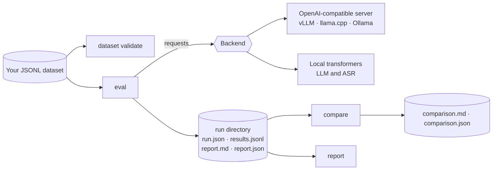

# AtlasForge

**Run, evaluate, compare and fine-tune the official N-ATLaS models** for Hausa, Yoruba, Igbo and Nigerian-accented English.

> *"I changed this N-ATLaS model. Did I actually make it better on my task, and where did it get worse?"*

N-ATLaS is published as gated open weights on Hugging Face. Developers get the models, but no tooling to measure them on their own data. AtlasForge is that tooling: a Python library and command-line tool that turns a JSONL file of your examples into a trustworthy answer.

!!! info "Project status: pre-alpha (`0.1.0.dev0`)"
    Built for NAIC 2026, Problem 01 (Developer Infrastructure). Every feature in this documentation is labelled by how well it has been verified. Nothing is claimed to work unless it says so. See [Status and roadmap](project/status.md) for the full picture, including what has been run against real model weights and what has not.

## What you can do with it

| You want to | Command | Guide |
|---|---|---|
| Check your machine is ready | `atlasforge doctor` | [Installation](getting-started/installation.md) |
| Send one prompt to a model | `atlasforge run "Ina kwana?"` | [Quickstart](getting-started/quickstart.md) |
| Score a model on your own dataset | `atlasforge eval` | [Evaluate a model](guides/evaluate.md) |
| Find out whether a change really helped, and where it hurt | `atlasforge compare` | [Compare two models](guides/compare.md) |
| Catch broken data before it ruins a result | `atlasforge dataset validate` | [Validate a dataset](guides/validate-dataset.md) |
| Transcribe Hausa, Yoruba, Igbo or Nigerian English speech | `atlasforge transcribe` | [Speech](guides/asr.md) |
| Re-score a finished run with different metrics, no model needed | `atlasforge report` | [Evaluate a model](guides/evaluate.md#re-scoring-without-a-model) |

## Why it exists

Three things make evaluating Nigerian-language models different from evaluating English ones, and AtlasForge is built around them.

1. **Tone marks and special letters are meaning, but writers are inconsistent.** The same Yoruba sentence can arrive with or without tone marks, in precomposed or combining Unicode. A naive string comparison scores identical answers as wrong. AtlasForge reports every text metric under both a [tone-aware and a tone-insensitive view](concepts/tone-aware-scoring.md), and never strips the letters that carry meaning (Yoruba and Igbo underdots, Hausa hooked letters).
2. **Datasets are small, so luck matters.** With 80 examples, a three-point gain can be noise. AtlasForge uses [paired bootstrap intervals and an exact McNemar test](concepts/honest-statistics.md), and only says *improved* or *regressed* when the whole interval is on one side of zero. Slices under 30 examples are reported as *insufficient data*.
3. **There is no hosted N-ATLaS API.** The models are gated downloads. AtlasForge talks to any OpenAI-compatible server (vLLM, llama.cpp, Ollama, your own gateway) or loads the weights directly with `transformers`, so you choose where the model runs.

## How it fits together

Read [How AtlasForge works](concepts/how-it-works.md) for the design, or jump straight to the [Quickstart](getting-started/quickstart.md).

## Principles

- **Only official models.** Core paths use only the `NCAIR1/*` N-ATLaS models. There is no other foundation model, and no LLM-as-judge.
- **Never invent behaviour.** Facts about the models are labelled `VERIFIED`, `INFERRED` or `UNKNOWN` in [Verified model facts](natlas/model-facts.md).
- **Failures count against the model.** A failed call is scored as a wrong answer, never silently dropped.
- **No weights are ever redistributed.** You download them yourself under your own accepted [licence](natlas/licence.md).
- **A light core.** `pip install atlasforge` does not import `torch` or `transformers`. Heavy stacks are optional extras.
- **No secrets in output.** Tokens are masked; error messages never contain response bodies; logs hold no prompts or audio.

## What AtlasForge is not

- It is **not an SDK, gateway or playground** for N-ATLaS. Other projects provide those, and AtlasForge works with them through the OpenAI-compatible backend.
- It is **not a judge of open-ended quality.** It measures against references you provide. It does not score fluency or factuality on its own.
- It does **not host or redistribute** the models.
